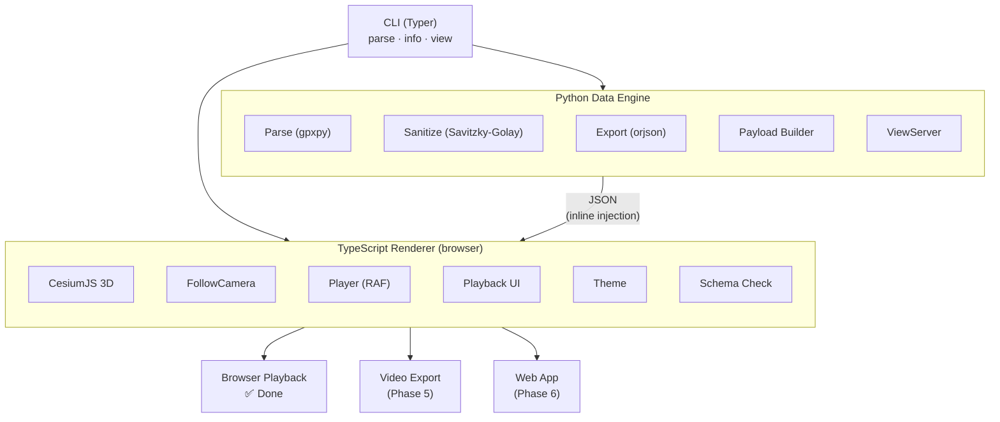
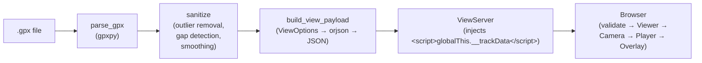

# GPXFlythrough

Convert GPX tracks into interactive 3D flythrough visualizations.

## What It Does

GPXFlythrough takes your GPS recording files (`.gpx`) and produces:

- **Interactive 3D flythrough viewer** — a drone-like camera following your route over realistic terrain, with play/pause, speed control, and timeline scrubbing
- **Data overlays** — heart rate, speed, and elevation profile visualized alongside the route (coming in Phase 3)

All rendering runs **locally** — no cloud uploads, no API keys required for basic usage.

## Install

```bash
git clone https://github.com/nick8592/GPXFlythrough.git
cd GPXFlythrough
uv sync

# Set up the TypeScript renderer:
cd renderer
npm ci
cd ..
```

Requires Python 3.13+, [uv](https://docs.astral.sh/uv/), and Node.js 20+.

## Usage

```bash
# Show track summary
gpxflythrough info hike.gpx

# Parse and sanitize, export as JSON
gpxflythrough parse hike.gpx -o cleaned.json

# Export as GeoJSON
gpxflythrough parse hike.gpx -o cleaned.geojson --format geojson

# Skip sanitization
gpxflythrough parse hike.gpx -o raw.json --no-sanitize

# Open interactive 3D flythrough viewer
gpxflythrough view hike.gpx
```

### View Options

| Flag | Values | Default |
|------|--------|---------|
| `--no-terrain` | Disable terrain (flat ellipsoid) | off |
| `--no-browser` | Don't auto-open browser | off |
| `--theme` | `dark`, `light` | `dark` |
| `--speed` | `0.5`, `1`, `2`, `4` | `1` |
| `--height` | Camera height above terrain (m) | `50` |
| `--port` | Server port (0 = random) | `0` |
| `--token` | Cesium Ion access token | none |

```bash
# View without terrain (no API key needed)
gpxflythrough view hike.gpx --no-terrain

# Start at 2x speed with light theme
gpxflythrough view hike.gpx --speed 2 --theme light

# Use a specific port
gpxflythrough view hike.gpx --port 8080
```

### Example output

```
$ gpxflythrough info examples/Nangang_Ridge_Hike.gpx

                 南港山縫走                  
┏━━━━━━━━━━━━━━━┳━━━━━━━━━━━━━━━━━━━━━━━━━━━┓
┃ Property      ┃ Value                     ┃
┡━━━━━━━━━━━━━━━╇━━━━━━━━━━━━━━━━━━━━━━━━━━━┩
│ Activity      │ hiking                    │
│ Segments      │ 1                         │
│ Total points  │ 5850                      │
│ Elevation min │ 20.0 m                    │
│ Elevation max │ 366.2 m                   │
│ Has HR data   │ no                        │
│ Has cadence   │ no                        │
│ Has speed     │ no                        │
│ Start time    │ 2026-07-26T07:30:34+00:00 │
└───────────────┴───────────────────────────┘
```

## Data Pipeline

GPX files go through a sanitization pipeline before rendering:

1. **Outlier removal** — points implying impossible speed (>150 km/h) are removed
2. **Timestamp gap detection** — gaps >10s between points are flagged
3. **Elevation interpolation** — missing elevations filled from neighbors
4. **Savitzky-Golay smoothing** — reduces GPS jitter while preserving path shape

Track segments are never bridged — if GPS recording was interrupted (tunnels, paused device), each segment stays separate.

## Project Structure

```
GPXFlythrough/
├── src/gpxflythrough/          # Python data engine + CLI
│   ├── cli.py                  # Typer CLI: parse, info, view
│   ├── models.py               # Domain models (TrackData, SanitizedTrack, branded types)
│   ├── parser/                 # GPX parsing (gpxpy wrapper)
│   ├── sanitize/               # Outlier removal, gap detection, smoothing
│   ├── export/                 # JSON/GeoJSON export (orjson)
│   └── viewer/                 # Interactive viewer backend
│       ├── payload.py           # ViewOptions + build_view_payload()
│       └── server.py           # ViewServer (ThreadingHTTPServer + payload injection)
├── renderer/                   # TypeScript browser-side renderer
│   ├── src/
│   │   ├── main.ts             # Entry: validate → viewer → terrain → camera → player → overlay
│   │   ├── types/track.ts      # TrackRenderPayload schema types
│   │   ├── schema/track-render.ts  # validate() runtime checker
│   │   ├── controller.ts       # CameraController interface
│   │   ├── camera.ts           # FollowCamera (lookahead-based orientation)
│   │   ├── player.ts           # Player state machine (idle/playing/paused/finished)
│   │   ├── viewer.ts           # CesiumJS Viewer factory
│   │   ├── terrain.ts          # Cesium Ion terrain / ellipsoid fallback
│   │   ├── theme.ts            # Dark / light / transparent theme
│   │   ├── track.ts            # Track polyline + waypoint entities
│   │   ├── ui/
│   │   │   ├── playback-overlay.ts  # DOM playback controls
│   │   │   └── playback-overlay.css
│   │   └── cesium.d.ts         # CesiumJS type declarations
│   ├── index.html              # Mount point (cesiumContainer div)
│   └── src/__tests__/          # Vitest tests (37 tests)
├── tests/                      # Python tests (87 tests)
├── examples/                   # Sample GPX files
└── .github/workflows/ci.yml   # CI: Python + renderer jobs
```

## Architecture



**Data Engine (Python)** — GPX parsing (`gpxpy`), GPS noise reduction (Savitzky-Golay filter), timestamp gap interpolation, and clean JSON/GeoJSON export (`orjson`). The `viewer/` module builds the `TrackRenderPayload` JSON and serves it via a `ThreadingHTTPServer` that injects the payload inline into the HTML.

**Renderer (TypeScript)** — CesiumJS for 3D terrain flythrough, `FollowCamera` with lookahead-based orientation, `Player` state machine driving `requestAnimationFrame` playback, DOM-based playback overlay (play/pause, progress seek, speed control, time display), and theme support. The renderer reads `globalThis.__trackData` (injected by Python) and validates it against the schema before initializing.

## Data Flow



### Schema Contract (v1.0.0)

The JSON payload exchanged between Python and TypeScript follows the `TrackRenderPayload` schema. Both sides validate against version `"1.0.0"`.

```typescript
interface TrackRenderPayload {
  schema_version: "1.0.0";
  track: {
    name: string;
    activity_type: string | null;
    bounds: { min_lat, max_lat, min_lon, max_lon, min_ele, max_ele };
    segments: Array<{
      index: number;
      start_time_iso: string | null;
      duration_s: number;
      length_m: number;
      points: Array<{
        lat, lon, ele, time, cumulative_m, speed, hr, cad, temp
      }>;
    }>;
    waypoints: Array<{ lat, lon, ele, name, time }>;
  };
  render: {
    fps: 60;                    // browser mode
    resolution: { label: "browser", width: 0, height: 0 };
    camera: { mode, height_above_terrain_m, lookahead_m, pitch_deg };
    theme: "dark" | "light";
    overlays: string[];         // reserved for Phase 3
    no_terrain: boolean;
  };
}
```

When adding new fields, bump `schema_version` and update both `renderer/src/types/track.ts` and `src/gpxflythrough/viewer/payload.py`.

## Terrain Data

3D mode uses **Copernicus DEM GLO-30** (30m resolution, ±4m vertical accuracy) for realistic terrain rendering. Terrain tiles are fetched on-demand from Cesium Ion. Use `--no-terrain` for a flat ellipsoid that doesn't require an API token.

## Roadmap

```mermaid
gantt
    title GPXFlythrough Phases
    dateFormat X
    axisFormat %s

    section Done
    Phase 0 — Parsing & CLI          :done, p0, 0, 1
    Phase 1 — Interactive 3D Viewer   :done, p1, 1, 2

    section Next
    Phase 2 — 2D Map Viewer (MapLibre): p2, 2, 3
    Phase 3 — Data Overlays           : p3, 3, 4
    Phase 4 — Camera Modes & Themes   : p4, 4, 5

    section Future
    Phase 5 — Video Export            : p5, 5, 6
    Phase 6 — Web App                 : p6, 6, 7
```



- [x] **Phase 0** — GPX parsing, data sanitization, CLI skeleton
  - `parse` and `info` commands, outlier removal, Savitzky-Golay smoothing, JSON/GeoJSON export
- [x] **Phase 1** — Interactive 3D flythrough viewer
  - CesiumJS globe, FollowCamera, Player state machine, playback overlay (play/pause/seek/speed), Python HTTP server with payload injection
- [ ] **Phase 2** — 2D map viewer (MapLibre GL JS)
  - Add a MapLibre-based 2D renderer alongside CesiumJS, with shared Player/overlay architecture. Track drawing animation on a flat map with auto-follow camera. Reuse `TrackRenderPayload` schema.
- [ ] **Phase 3** — Data overlays
  - Heart rate, speed, and elevation profile charts rendered alongside the track. Extend `TrackRenderPayload` with `overlays` config. Add overlay components to the playback UI.
- [ ] **Phase 4** — Camera modes and visual themes
  - Additional camera modes (birdseye, cinematic orbit, first-person). Custom visual themes beyond dark/light. Camera configuration UI in the playback overlay.
- [ ] **Phase 5** — Video export (Puppeteer + FFmpeg)
  - Headless frame capture via Puppeteer CDP `beginFrame`, piped to FFmpeg for H.264 encoding. Deterministic frame-by-frame rendering at configurable fps/resolution. Reuses the same renderer with a headless Player (no RAF — tick-driven).
- [ ] **Phase 6** — Web app
  - Next.js frontend with Tailwind CSS. Upload GPX, job queue for rendering, shareable viewer links. Backend wraps the existing Python data engine.

## Extending the Project

### Adding a new renderer module (e.g., 2D MapLibre)

1. Create `renderer2d/` with its own `package.json`, `vite.config.ts`, and `index.html`
2. Reuse `types/track.ts` and `schema/track-render.ts` (copy or shared package)
3. Implement `CameraController` interface from `controller.ts` for the 2D camera
4. Reuse `player.ts` by injecting a `CameraController` — the Player is renderer-agnostic
5. Add a new `gpxflythrough view2d` CLI command (or `view --mode 2d`)

### Adding data overlays

1. Extend `TrackRenderPayload.render.overlays` with overlay config (e.g., `["elevation", "hr"]`)
2. Bump `schema_version` to `"1.1.0"` in both `types/track.ts` and `payload.py`
3. Add overlay components to `renderer/src/ui/` (chart libraries, DOM panels)
4. Mount overlays in `main.ts` after the playback overlay

### Adding a camera mode

1. Create a new class implementing `CameraController` (see `camera.ts` for the pattern)
2. Register it via a `mode` field in `TrackRenderPayload.render.camera`
3. Add a CLI flag (e.g., `--camera orbit`) and update `ViewOptions` / `build_view_payload()`
4. In `main.ts`, select the camera class based on `payload.render.camera.mode`

## Example

The `examples/` directory contains `Nangang_Ridge_Hike.gpx` — a real hiking track from 南港山縱走 (Nangang Ridge Traverse) in Taipei, recorded via Strava with 5,850 trackpoints.

## Development

```bash
# Python
uv sync                          # install dependencies
uv run basedpyright src/         # type check (strict mode)
uv run ruff check src/           # lint (ALL rules)
uv run ruff format --check src/  # format check
uv run pytest tests/ -v          # run tests (87 tests)

# Renderer (renderer/)
cd renderer
npm ci                           # install dependencies
npm run typecheck                # TypeScript type check
npm run lint                     # ESLint
npm run test                     # Vitest (37 tests)
npm run build                    # Vite production build → dist/
```

## Tech Stack

| Component | Technology |
|-----------|-----------|
| Data Engine | Python 3.13+, gpxpy, scipy, orjson, typer, rich |
| 3D Renderer | CesiumJS |
| Interactive Playback | Vite + TypeScript |
| Terrain | Copernicus DEM GLO-30 (via Cesium Ion) |
| Video Export (Phase 5) | Puppeteer (CDP) → FFmpeg |
| Web App (Phase 6) | Next.js + Tailwind CSS |

## License

MIT
